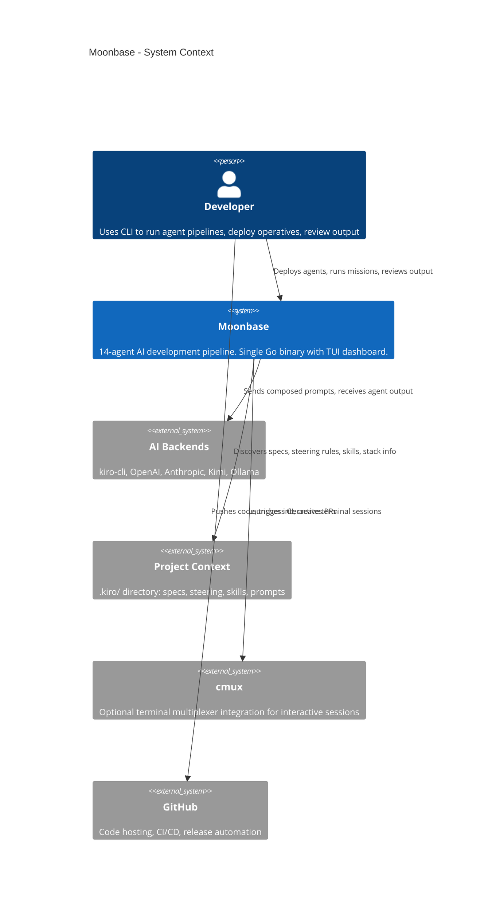
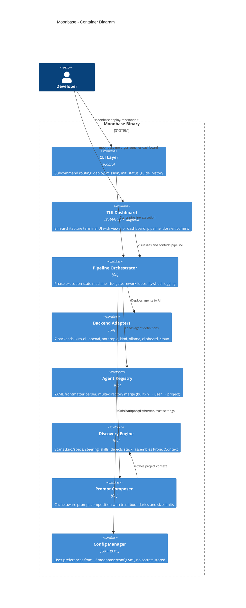
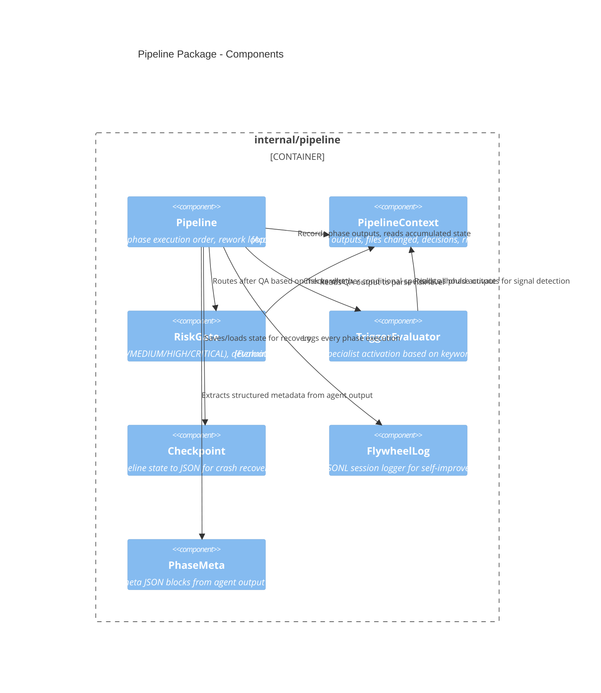

# Moonbase Architecture

## 1. Foundations

Moonbase's architecture draws from six intellectual foundations:

- **Clean Architecture** (Robert C. Martin) — The dependency rule governs package structure. Inner layers (domain entities, use cases) have zero knowledge of outer layers (frameworks, drivers). Dependencies always point inward.
- **Clean Code** (Robert C. Martin) — Small functions with single responsibilities, intention-revealing names, DRY principle. Each file targets one responsibility, max ~300 lines before splitting.
- **The Clean Coder** (Robert C. Martin) — Professional discipline: comprehensive test coverage (1,218 tests across 16 packages), estimation through evidence, TDD where practical.
- **The C4 Model** (Simon Brown) — Architecture visualization at four zoom levels. This document uses C4's Context, Container, and Component diagrams to communicate structure without ambiguity.
- **OpenAI Practical Guide to Building Agents** — Guardrails as first-class concerns, orchestration patterns for multi-agent pipelines, structured handoffs, flywheel logging for continuous improvement.
- **Kiro CLI Patterns** — Specs as requirements contracts, steering rules as project conventions, skills as reusable knowledge, hooks for lifecycle events, flywheel for self-improvement loops.

---

## 2. C4 Context Diagram (Level 1)

The system boundary and its external actors.



---

## 3. C4 Container Diagram (Level 2)

Internal containers within the single moonbase binary.



---

## 4. C4 Component Diagram (Level 3) — Pipeline Package

Zooming into `internal/pipeline/`, the core orchestration engine.



---

## 5. Dependency Rule

Clean Architecture's dependency rule: source code dependencies point inward. Outer layers know about inner layers, never the reverse.

```
┌─────────────────────────────────────────────────────────┐
│  Frameworks & Drivers (outermost)                       │
│  cmd/moonbase (Cobra), internal/tui (Bubbletea),        │
│  internal/backend (HTTP clients, exec calls)            │
├─────────────────────────────────────────────────────────┤
│  Interface Adapters                                     │
│  internal/backend.Backend (interface),                  │
│  internal/discovery (project scanning),                 │
│  internal/discovery.ComposePrompt (prompt assembly)     │
├─────────────────────────────────────────────────────────┤
│  Use Cases                                              │
│  internal/pipeline (orchestration, risk routing,        │
│  trigger evaluation, checkpoint, flywheel)              │
├─────────────────────────────────────────────────────────┤
│  Entities (innermost)                                   │
│  internal/agents.Agent, internal/pipeline.Phase,        │
│  internal/pipeline.RiskLevel, internal/pipeline.Pipeline│
│  internal/discovery.ProjectContext                      │
└─────────────────────────────────────────────────────────┘
         ↑ Dependencies point inward (never outward)
```

**Layer mapping:**

| Layer | Packages | Characteristics |
|-------|----------|----------------|
| Entities | `agents.Agent`, `pipeline.Phase`, `pipeline.RiskLevel`, `discovery.ProjectContext` | Pure data structures, no framework imports, no I/O |
| Use Cases | `pipeline.Pipeline`, `pipeline.RiskGate`, `pipeline.TriggerEvaluator` | Business logic, depends only on entities and interfaces |
| Interface Adapters | `backend.Backend` interface, `discovery.Discover()`, `discovery.ComposePrompt()` | Adapts external systems to use-case needs |
| Frameworks & Drivers | `cmd/moonbase` (Cobra), `tui` (Bubbletea), `backend.Kiro` (exec), `backend.OpenAI` (HTTP) | External framework code, highest churn, lowest architectural significance |

**Key constraint:** The pipeline package never imports `cmd/`, `tui/`, or concrete backend implementations. It works through the `Backend` interface, which is defined in the `backend` package and injected at construction time.

---

## 6. Key Design Decisions

| Decision | Rationale | Trade-offs |
|----------|-----------|------------|
| **Single Go binary** | Zero runtime dependencies. `go build` produces one file that runs anywhere. No Python envs, no Node modules, no Docker required. | Larger binary size (~23MB). No hot-reload for agent changes (must rebuild for Go logic). |
| **Markdown agents** | Agents are `.md` files with YAML frontmatter — portable, human-readable, diffable, versionable. One file = one complete agent. | No compiled validation at write time. Must parse and validate at load time. |
| **Pipeline over single-agent** | Separation of concerns (analysis ≠ implementation ≠ QA). Risk gates between phases catch errors before they compound. Rework loops are bounded (max 2). | Higher latency for trivial tasks (mitigated by `--fast` mode). More complex orchestration code. |
| **Multiple backends** | Tool-agnostic philosophy. Works with kiro-cli, OpenAI, Anthropic, Kimi, Ollama, or clipboard fallback. Users aren't locked into one vendor. | Must maintain 7 adapter implementations. Lowest-common-denominator feature set across backends. |
| **SafeEnv for child processes** | Security boundary: child processes (AI backends spawned via exec) receive only allowlisted environment variables. Prevents secret leakage through `os.Environ()`. | Must explicitly allowlist new env vars when adding features. May break backends that expect undocumented env vars. |
| **Flywheel logging** | Self-improvement over time. Append-only JSONL captures every phase execution. `moonbase flywheel` surfaces patterns: which agents get reworked, which phases are slow, where risk gates fire. | Disk usage grows unbounded (mitigated: small entries, ~200 bytes each). Privacy consideration for task descriptions logged to disk. |
| **Cache-aware prompt composition** | Prompt ordering optimized for LLM prefix caching (Claude, GPT). Static content first (steering, agent prompt), dynamic content last (task). Higher cache hit rate = lower cost + latency. | Rigid composition order. Adding new context sections requires considering cache impact. |
| **Multi-directory agent merge** | Three-tier priority: project `.kiro/agents/` > user `~/.moonbase/agents/` > built-in `agents/`. Projects can override any agent. | Name collisions resolved silently by priority. Can be confusing when a project override shadows a built-in. |
